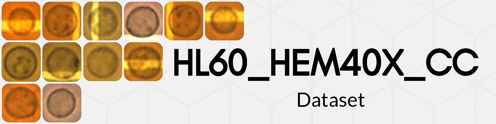
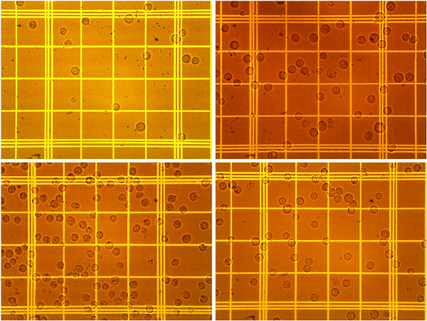
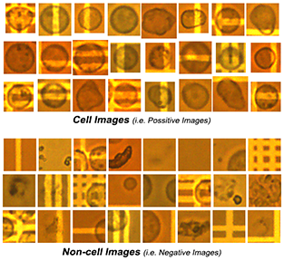
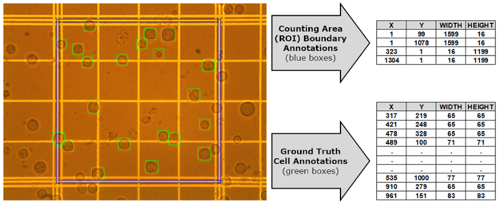

Welcome to our dataset repository. HL60_HEM40x_CC datset were collected at Atılım University, Cell Biology laboratory<a href="https://www.atilim.edu.tr/en/biochem" target="_blank"> (BIOCHEM)</a>, Turkey. The majority of the images obtained were collected during a drug development study in a variety of sessions. The dataset is publicly available to nonprofit research and can be downloaded here. 

## Dataset Description

This dataset contains Human Promyelocytic Leukemia (HL60) cancer cell images with magnification factor 40x by hemocytometer (HEM40X) for cell counting (CC). It has total 468 raw hemocytometer images acquired on 40x light-microscope objectives. Also, annotation information by domain experts shared as total 6890 cells.

The dataset consist of three complementary components, namely; Image Sets, Ground Truth Cell Annotations and Counting Area (ROI) Boundary Annotations.

<li type="A">Image Sets</li>
               
Images are acquired in different sessions by Motic B3-Series 2.0 Megapixels Moticam 2000 camera attached to the microscope. Moreover, the dataset contains 468 Red-Green-Blue (RGB) images in 1200x1600 pixel resolution. In particular, imperfect visualization, cell shape deformations, varying lighting, clumped cells and impurities are some of the real conditions observed in the dataset.            
                  
Randomly chosen 4 sample images given below from our gathered unique dataset those have possible adverse conditions, including, deformed cell shape, images with different brightness, single cell image with unequal brightness, images having clumped cells and impurities in cell suspension.

<li type="A">Ground Truth Cell Annotations</li>
               
Ground truth cell coordinates for each image are annotated by three experts by labelling 6890 cells in total. Experts annotate all cell locations as ‘Positive’ and non-cell locations as ‘Negative’. Randomly chosen sample croped images of cell and non-cell are given below from our dataset.

<li type="A">Counting Area (ROI) Boundary Annotations</li> 

For each image, the counting area boundary annotations are defined by employing the boundaries and they are manually annotated by the experts. Ultimately, each of the annotations are served separate file as the same format cell annotations. Each of the file has four entities which define the top, bottom, right and left boundaries of the counting area respectively. More precisely, the cells intersecting left and top sides of the middle of the triple lines are counted (i.e. counting area) yet the cells on the right and bottom ones are not counted in the process.

For the below figure, Left is considered one of the sample image from our proposed dataset with corresponding ground truth annotations as matrix form.  Cell locations are marked by green bounding boxes and four Counting Area (ROI) Boundary Annotations drawn by blue bounding boxes. The inside of area covered by these four squares is called the Counting Area (ROI).

## Citation    
 If you use this dataset, please cite the following paper:

**Özkan, A., İşgör, S. B., Şengül, G., & İşgör, Y. G. (2018). Computer vision based automated cell counting pipeline: a case
study for HL60 cancer cell on hemocytometer. Biomedical Research, 29(14), 2956-2962.**  &nbsp;&nbsp; <a style="text-decoration: underline; text-align: center" href="http://www.biomedres.info/biomedical-research/computer-vision-based-automated-cell-counting-pipeline-a-case-study-for-hl60-cancer-cell-on-hemocytometer.pdf">[pdf]</a> &nbsp;&nbsp;<a style="text-decoration: underline" href="./ComputerVisionBasedAutomatedCellCountingPipeline.bib">[BibTex]</a> 

## Terms of Use

<li style="padding-left: 1%; padding-right: 1%; font-weight: 300; text-align: justify;"> HL60_HEM40X_CC dataset is available for non-commercial research purposes only.</li>
<li style="padding-left: 1%; padding-right: 1%; font-weight: 300; text-align: justify;"> You agree not to reproduce, duplicate, copy, sell, trade, resell or exploit for any commercial purposes, any portion of the images and any portion of derived data.</li>
<li style="padding-left: 1%; padding-right: 1%; font-weight: 300; text-align: justify;">You agree not to further copy, publish or distribute any portion of the DeepFashion. Except, for internal use at a single site within the same organization it is allowed to make copies of the dataset </li>
<li style="padding-left: 1%; padding-right: 1%; font-weight: 300; text-align: justify;"> The authors reserve the right to terminate your access to HL60_HEM40X_CC dataset at any time.</li>
<li style="padding-left: 1%; padding-right: 1%; font-weight: 300; text-align: justify;"> Reference must be made to the above publication when this dataset is used in any academic and research reports, submitted papers or any publicly available text. </li>

## Download

You can download the dataset from Google Drive by using the provided link below. By downloading this dataset, you agree to our Terms of Use listed in above section. If you do not accept our Terms of Use, you are not granted the right to use the dataset.

<a href="https://drive.google.com/file/d/1zOiij8VDoP-yGtJ08F9mO3FPfAxuMPtC">Download HL60_HEM40X_CC Dataset</a>

 
   
